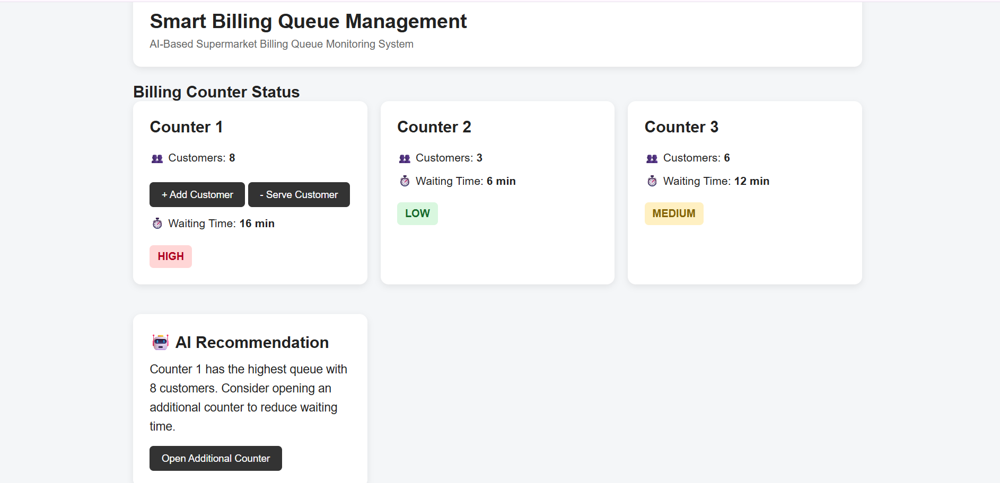
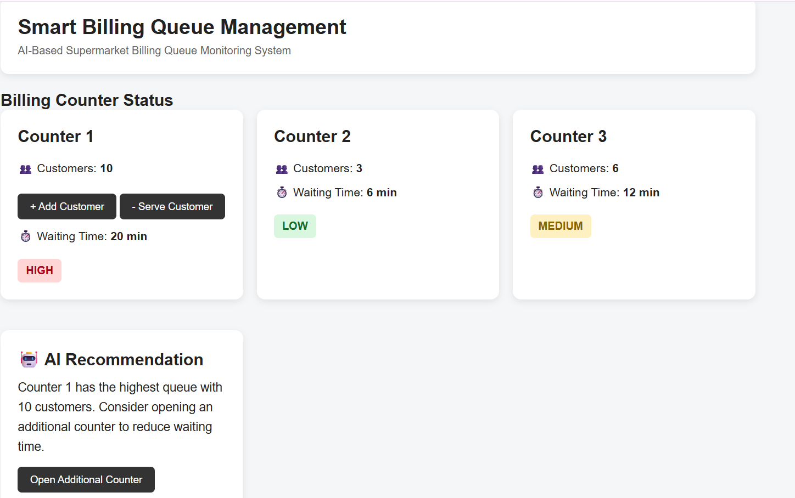

# AI-Based Smart Billing Queue Management

## Project Overview

AI-Based Smart Billing Queue Management is a web-based prototype designed to help supermarkets reduce customer waiting time at billing counters.

The system monitors the number of customers in each billing queue, estimates the waiting time, identifies crowded counters, and provides an AI-based recommendation to open an additional billing counter when required.

## Problem Statement

Customers in supermarkets often experience long and unpredictable waiting times at billing counters because queue lengths vary and staff may not know when an additional counter is required.

## Proposed Solution

The proposed system provides a simple dashboard for monitoring billing queues.

The system:

- Displays the number of customers at each counter
- Calculates estimated waiting time
- Classifies queues as LOW, MEDIUM, or HIGH
- Identifies the most crowded counter
- Provides an AI-based recommendation
- Allows staff to add or serve customers
- Suggests opening an additional counter when the queue is high

## Queue Classification

| Customers | Queue Status |
|-----------|--------------|
| 0–3 | LOW |
| 4–6 | MEDIUM |
| 7+ | HIGH |

Estimated waiting time is calculated as:

**Waiting Time = Number of Customers × 2 minutes**

## Key Features

- Real-time queue count update
- Estimated waiting time
- Queue status classification
- AI recommendation
- Live queue summary
- Average waiting time monitoring
- Add customer functionality
- Serve customer functionality
- Additional counter recommendation
- Simple and user-friendly dashboard

## Technology Used

- HTML
- CSS
- JavaScript
- GitHub

## Prototype

The prototype is currently implemented as a web dashboard.

The dashboard contains three billing counters and an AI Recommendation section for supermarket staff.

## User Validation

The prototype is being validated with real users to understand whether the queue information, waiting-time estimation, and AI recommendation are easy to understand and useful.

User feedback will be used to improve the prototype.
## Screenshots

### Main Dashboard



### AI Recommendation




## Project Status

**Review 1 – Prototype Development**

Current focus:

- Problem identification
- AI-assisted solution ideation
- Prototype development
- GitHub repository setup
- User validation

## Repository Structure

```text
AI-Smart-Billing-Queue
│
├── frontend
│   ├── index.html
│   ├── script.js
│   └── style.css
│
└── README.md